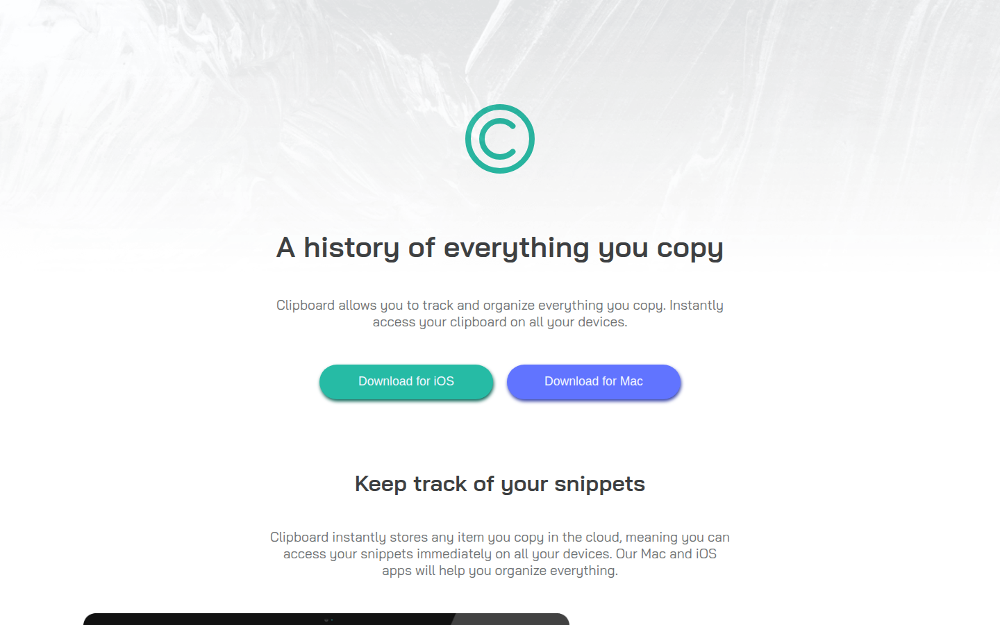
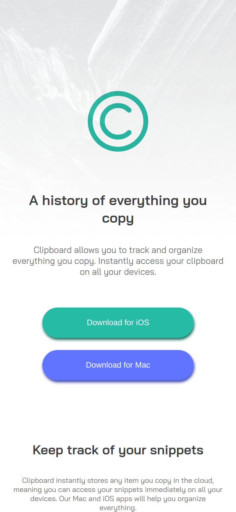

# Clipboard Landing Page

A product landing page for a fictional clipboard-sync app, built with React components from a [Frontend Mentor](https://www.frontendmentor.io/challenges) design.





## Features

- Hero with download buttons for iOS and Mac
- "Keep track of your snippets" section with Quick Search, iCloud Sync, and Complete History
- "Access Clipboard anywhere" devices section
- "Supercharge your workflow" feature cards
- Closing call to action and footer
- Responsive layout for desktop, tablet, and mobile

## Built with

- React 18 (Create React App)
- One component per section: `Main`, `SectionTrack`, `SectionClipboard`, `SectionSupercharge`, `SecondClipboard`, `Footer`
- CSS with Flexbox and media queries

## Run locally

```bash
npm install
npm start        # http://localhost:3000
npm run build    # production build in build/
```
